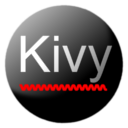

# kivy Language in VS Code

  

This project introduces Kivy (KV) language support to VS Code.

Kivy is a open source library to make cool user interfaces using Python.
If you would like to learn more please visit: https://kivy.org/

Supports Visual Code version 1.16.0 and up.

## Features

Current features:

* Syntax highlighting
* Code snippets for widgets
* A language server providing diagnostics

## Preview

### Syntax highlighting

## Unit testing

This project uses [Mocha](http://mochajs.org/) as an testing framework and [Chai](http://chaijs.com/) as an assertion libray.

Run the tests by executing the command `npm test`.

## Testing extension

1. Install all packages by running:

       "npm install"

2. Compile the program by running:

        "npm run compile"

3. Start debugging by hitting F5